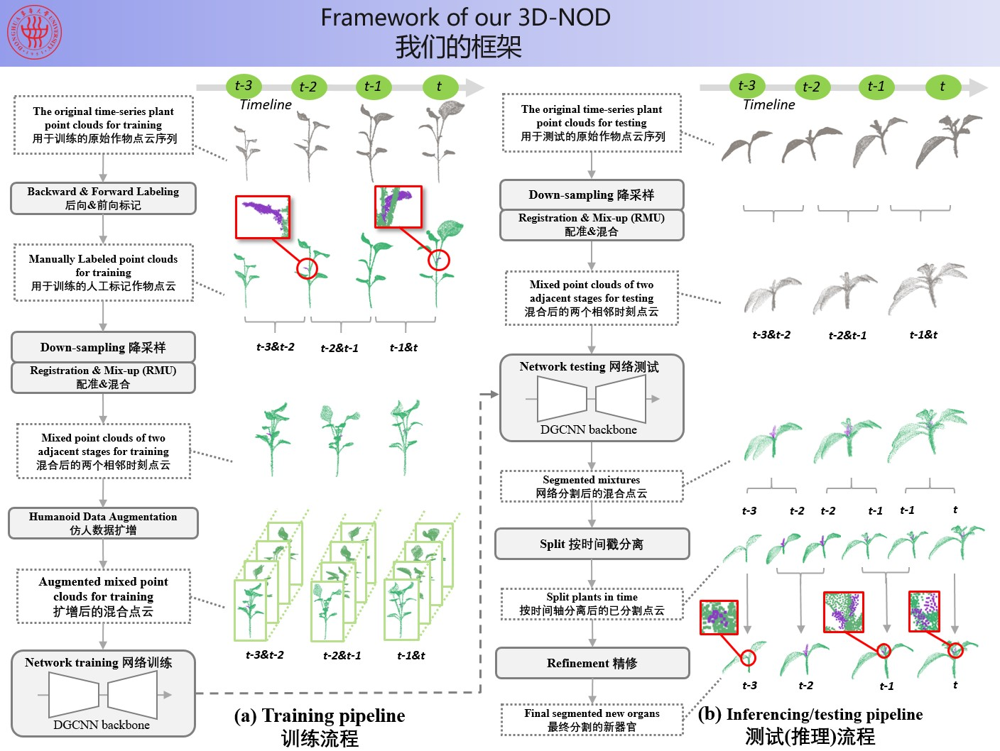
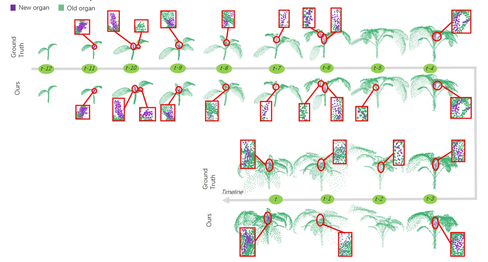
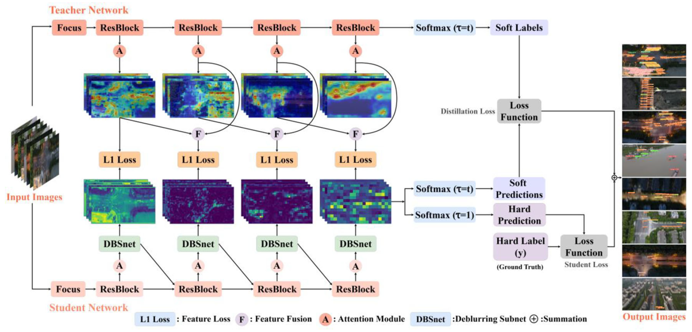
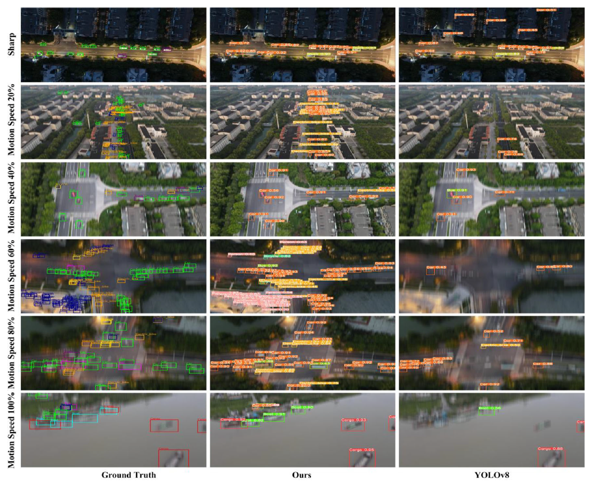
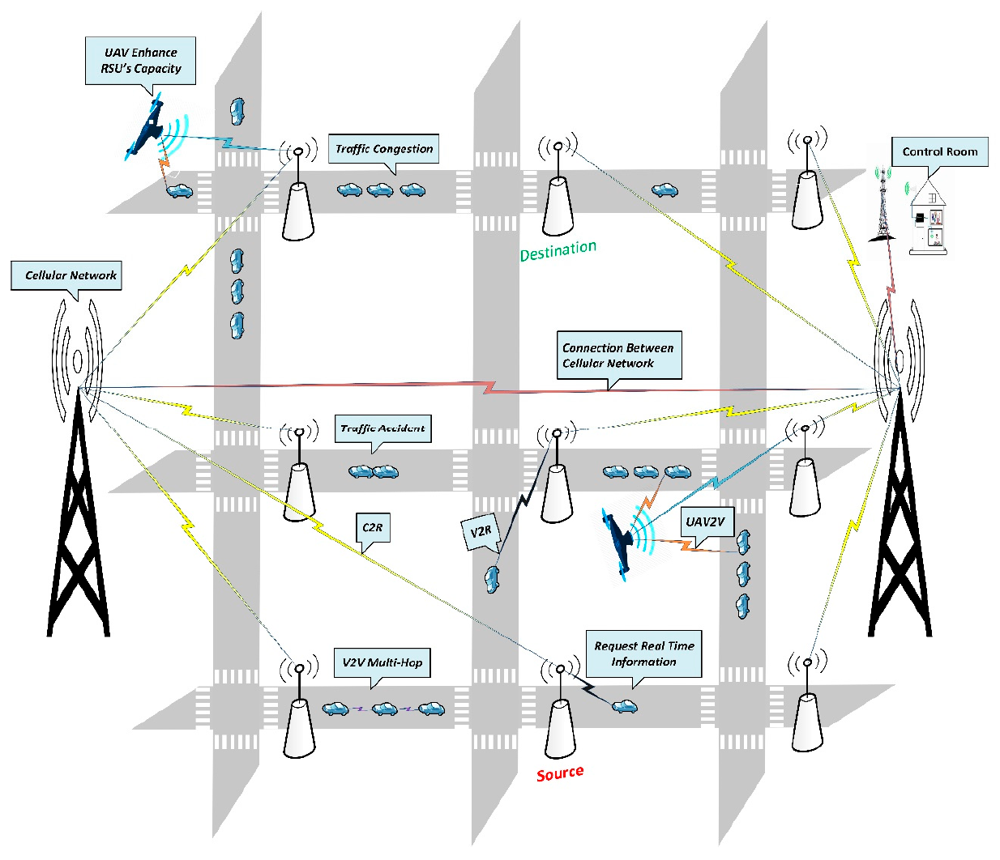

## Foysal Ahmed

**PhD Student**  
**Donghua University (211, Double First-Class) · Shanghai, China**  

📧 **Email:** [foysal.9@outlook.com](mailto:foysal.9@outlook.com)   
🌐 **GitHub:** [github.com/foysalahmed10](https://github.com/foysalahmed10)   
📄 **CV:** [Download CV](cv.pdf)   
🎓 **Google Scholar:** [Google Scholar Profile](https://scholar.google.com/citations?user=1HUchzEAAAAJ&hl=en)

---

## Academic History and Education Background

I received my **Bachelor’s degree in Software Engineering** from **Daffodil International University**, Bangladesh, in **2018**. In **September 2019**, I was awarded the **Chinese Government Scholarship** and moved to China to pursue graduate studies. I completed my **Master’s degree in Information and Communication Engineering** at **Donghua University**, Shanghai, China, in **2022**. Following my master’s studies, I was awarded the **Shanghai Government Scholarship** to pursue my **PhD** at **Donghua University**. I am currently a PhD student in the **Information and Communication Intelligent Systems** program, where my research focuses on data-driven methods for **3D plant phenotyping, 3D point cloud processing, generative modeling and computer vision**.

---

## Honors and Awards

- **Shanghai Government Scholarship** for PhD Study, China  
  Awarded for doctoral study at Donghua University.

- **Chinese Government Scholarship** for Master’s Study, China  
  Awarded for full-time master’s study at Donghua University.

- **Excellent International Graduate Award**, Donghua University, China, 2022  
  Awarded in recognition of outstanding academic performance and overall excellence during master’s study.

- **Outstanding International Student Award**, Donghua University, China, 2021  
  Awarded for excellent academic performance and active participation in university activities.

- **Certificate of Honor for Outstanding Performance**,  
  International Cultural Exchange School, Donghua University, 2019  
  Awarded for outstanding performance during the International Cultural Festival of Donghua University.

- **Certificate of Merit for Social Work**,  
  International Cultural Exchange School, Donghua University, Spring 2023  
  Awarded in recognition of contributions to social and cultural activities.

---

## Research Interests
- 3D Plant Phenotyping  
- Point Cloud Processing and Learning  
- Deep Learning for Agriculture  
- Generative Models (GANs, Diffusion Models)  

---

## Upcoming & Ongoing Projects

### 🌶️ Pepper-4D — 4D Plant Point Cloud Dataset

  

**Resources**  
- 📄 **Paper:** to be published
- 💻 **Code:** [https://github.com/  ](https://github.com/foysalahmed10/Pepper-4D)

**Introduction**  

Three-dimensional (3D) plant phenotyping plays a crucial role in analyzing
plant structure, organ-level traits, and growth dynamics.
While recent advances in 2D and 3D vision have accelerated research in plant
phenotyping, publicly available **spatiotemporal 3D datasets for pepper plants**
remain extremely limited.

Pepper-4D addresses this gap by providing a **comprehensive 4D (3D + time) point
cloud dataset** capturing the complete growth and developmental process of
pepper plants under controlled indoor conditions.
The dataset enables detailed analysis of plant structure, organ dynamics,
temporal growth patterns, and plant health status.
Pepper-4D is designed as a benchmark resource for both discriminative and
generative learning methods on 3D plant point clouds.

**Dataset Overview**   

- **Species:** Pepper (*Capsicum annuum*)
- **Total plants:** 29
- **Total point clouds:** 916
- **Total points:** 322.72 million
- **Total dataset size:** ~20 GB
- **Data modality:** 3D point clouds (XYZ)
- **Temporal resolution:** Bi-daily scans
- **Environment:** Indoor controlled conditions

**Comparison with Existing 3D Crop Datasets**   

The following table provides a high-level comparison between Pepper-4D and
representative publicly available 3D crop datasets.

<table align="center">
  <thead>
    <tr>
      <th align="center">Dataset</th>
      <th align="center">Species</th>
      <th align="center"># Point Clouds</th>
      <th align="center"># Temporal Coverage (4D)</th>
      <th align="center">Acquisition Modality</th>
      <th align="center">Color</th>
    </tr>
  </thead>
  <tbody>
    <tr>
      <td align="center">Conn et al. (2017)</td>
      <td align="center">Tomato, Tobacco, Sorghum</td>
      <td align="center">558</td>
      <td align="center">Yes</td>
      <td align="center">Laser</td>
      <td align="center">No</td>
    </tr>
    <tr>
      <td align="center">ROSE-X (2020)</td>
      <td align="center">Rose</td>
      <td align="center">11</td>
      <td align="center">No</td>
      <td align="center">X-ray CT</td>
      <td align="center">No</td>
    </tr>
    <tr>
      <td align="center">Pheno4D (2021)</td>
      <td align="center">Maize, Tomato</td>
      <td align="center">126</td>
      <td align="center">Yes</td>
      <td align="center">Laser</td>
      <td align="center">No</td>
    </tr>
    <tr>
      <td align="center">Soybean-MVS (2023)</td>
      <td align="center">Soybean</td>
      <td align="center">102</td>
      <td align="center">Yes</td>
      <td align="center">MVS</td>
      <td align="center">Yes</td>
    </tr>
    <tr>
      <td align="center">PLANesT-3D (2024)</td>
      <td align="center">Pepper, Rose, Ribes</td>
      <td align="center">34</td>
      <td align="center">No</td>
      <td align="center">SfM-MVS</td>
      <td align="center">Yes</td>
    </tr>
    <tr>
      <td align="center">BonnBeetClouds3D (2024)</td>
      <td align="center">Sugar Beet</td>
      <td align="center">3000</td>
      <td align="center">No</td>
      <td align="center">UAV Photogrammetry</td>
      <td align="center">Yes</td>
    </tr>
    <tr>
      <td align="center">Crops3D (2024)</td>
      <td align="center">Multiple species</td>
      <td align="center">1230</td>
      <td align="center">Partial</td>
      <td align="center">SfM-MVS, TLS</td>
      <td align="center">Yes</td>
    </tr>
    <tr>
      <td align="center">MaizeField3D (2025)</td>
      <td align="center">Maize</td>
      <td align="center">1045</td>
      <td align="center">No</td>
      <td align="center">TLS + Procedural</td>
      <td align="center">Yes</td>
    </tr>
    <tr>
      <td align="center"><b>Pepper-4D (2026)</b></td>
      <td align="center"><b>Pepper</b></td>
      <td align="center"><b>916</b></td>
      <td align="center"><b>Yes</b></td>
      <td align="center"><b>SfM + NeRF</b></td>
      <td align="center"><b>Yes</b></td>
    </tr>
  </tbody>
</table>

**Dataset Acquisition and Reconstruction**   

  

Pepper-4D was constructed through a multi-stage pipeline including image
acquisition, preprocessing, 3D reconstruction, and plant-only point cloud
generation. Multi-view images were captured for each plant at each time step,
followed by 3D reconstruction and post-processing to obtain temporally aligned
point clouds.

**Dataset Subsets**   

Pepper-4D consists of three subsets capturing different growth scenarios and
phenotyping tasks.

**Subset 1 — Full Lifecycle**   

  

- **Plants:** 11  
- **Point clouds:** 460  
- **Description:**  
  Long-term monitoring from early vegetative growth to flowering,
  fruiting, and senescence.
- **Annotations:**  
  Semantic, instance, temporal, and health labels.

**Subset 2 — Geotropism Tests**    

  

- **Plants:** 8  
- **Point clouds:** 238  
- **Description:**  
  Sequences focusing on **new organ detection and Geotropism tests**.
- **Annotations:**  
  New organ detection labels.

**Subset 3 — Early–Mid Growth**   

- **Plants:** 10  
- **Point clouds:** 218  
- **Description:**  
  Early and mid growth stages with rapid structural changes.
- **Annotations:**  
  None 

---

## Publications (Selected)

### 3D-NOD: 3D New Organ Detection in Plant Growth by a Spatiotemporal Point Cloud Deep Segmentation Framework

Dawei Li†, **Foysal Ahmed**†, Z. Wang†  
<strong>Plant Phenomics</strong>, 2025. 
† Contributed equally.

**Brief Description:**  
This paper presents a spatiotemporal deep learning framework for detecting newly emerged plant organs from 4D point cloud sequences.  
By jointly modeling spatial structure and temporal growth dynamics, the proposed method enables accurate and robust organ-level analysis during plant development.

**Resources**  
- 📄 **Paper:** [https://www.sciencedirect.com](https://doi.org/10.1016/j.plaphe.2025.100002)/  
- 💻 **Code:** [https://github.com/  ](https://github.com/foysalahmed10/3D-New-Organ-Detection-in-Plant-Growth-from-Spatiotemporal-Point-Clouds)

<table border="0">
  <tr>
    <td align="center">
      
    </td>
  </tr>
</table>
<table border="0">
  <tr>
    <td align="center">
      
    </td>
  </tr>
</table>
<table border="0">
  <tr>
    <td align="center">
      
    </td>
  </tr>
</table>

---

### A Novel Knowledge Distillation Framework for Enhancing Small Object Detection in Blurry Environments with UAV-Assisted Images

Sayed Jobaer, Xue-song Tang, Yihong Zhang, Gaojian Li, **Foysal Ahmed**  
<strong>Complex & Intelligent Systems</strong>, 2025.  

**Brief Description:**  
This paper proposes a novel knowledge distillation framework to enhance small object detection performance in blurry UAV-assisted images.  
The method integrates attention-guided feature distillation and a feature-level deblurring subnet within a self-supervised learning paradigm, enabling robust detection without relying on explicit image deblurring. Experimental results on VisDrone and a newly developed UAV small object detection dataset demonstrate consistent performance improvements over state-of-the-art methods.

**Resources**  
- 📄 **Paper:** [https://doi.org/10.1007/s40747-024-01676-w  ](https://link.springer.com/article/10.1007/s40747-024-01676-w)
- 💻 **Code:** *(to be released)*  

<table border="0">
  <tr>
    <td align="center">
      
       
      <em>Overview of the proposed knowledge distillation and feature-level deblurring framework.</em>
    </td>
  </tr>
</table>
<table border="0">
  <tr>
    <td align="center">
      
       
      <em>Overview of the proposed knowledge distillation and feature-level deblurring framework.</em>
    </td>
  </tr>
</table>

---

### YOLO-JD: A Deep Learning Network for Jute Diseases and Pests Detection

Dawei Li†, **Foysal Ahmed**†, N. Wu, and A. I. Sethi 
<strong>Plants</strong>, 2022. 
† Contributed equally.

**Brief Description:**  
This work proposes a YOLO-based detection framework for identifying jute diseases and pests from field images, enabling practical and efficient disease monitoring in real agricultural environments.

**Resources**  
- 📄 **Paper:** [https://doi.org/10.3390/plants11070937 ](https://doi.org/10.3390/plants11070937) 
- 💻 **Code:** [https://github.com/foysalahmed10/YOLO-JD  ](https://github.com/foysalahmed10/YOLO-JD)

<table border="0">
  <tr>
    <td align="center">
      
       
      <em>The overall architecture of YOLO-JD.</em>
    </td>
  </tr>
</table>

<table border="0">
  <tr>
    <td align="center">
      
       
      <em>YOLO-JD predictions on complex background images.</em>
    </td>
  </tr>
</table>

---

### UAV-Assisted Hybrid Scheme for Urban Road Safety Based on VANETs

Sayed Jobaer, Yihong Zhang*, Muhammad Ather Iqbal Hussain, **Foysal Ahmed** 
<strong>Electronics</strong>, 2020. 
*Corresponding author.*

**Brief Description:**  
This paper proposes a UAV-assisted hybrid routing framework for urban vehicular ad hoc networks (VANETs) to improve road safety and congestion control. By integrating unmanned aerial vehicles (UAVs) with roadside units and vehicular communication, the proposed scheme enhances packet delivery ratio, reduces end-to-end delay, and improves energy efficiency under realistic urban traffic conditions.

**Resources**  
- 📄 **Paper:** [https://www.mdpi.com/2079-9292/9/9/1499](https://doi.org/10.3390/electronics9091499)
- 💻 **Code:** *(to be released)*  

<table border="0">
  <tr>
    <td align="center">
      
       
      <em>UAV-assisted VANET architecture for urban traffic congestion control.</em>
    </td>
  </tr>
</table>

---

<!-- Visitor Statistics (Footer) -->

  <!-- Page View Counter -->
  

    Page views: —
  

  <!-- Visitor Map -->
  

    
  

<!-- Busuanzi Counter Script -->

