<!-- Add Font Awesome link in the <head> section of your HTML -->
<link rel="stylesheet" href="https://cdnjs.cloudflare.com/ajax/libs/font-awesome/5.15.3/css/all.min.css">

<!-- Container for centering content -->

  <a href="mailto:foysal.9@outlook.com"><i class="fas fa-envelope"></i> Email</a> ·
  <a href="https://github.com/foysalahmed10" target="_blank"><i class="fab fa-github"></i> GitHub</a> ·
  <a href="/assets/cv.pdf" target="_blank"><i class="fas fa-file-pdf"></i> CV</a> ·
  <a href="https://scholar.google.com/citations?user=1HUchzEAAAAJ&hl=en" target="_blank"><i class="fas fa-graduation-cap"></i> Google Scholar</a>

---

## Academic History and Education Background

I received my **Bachelor’s degree in Software Engineering** from **Daffodil International University**, Bangladesh, in **2018**. In **September 2019**, I was awarded the **Chinese Government Scholarship** and moved to China to pursue graduate studies. I completed my **Master’s degree in Information and Communication Engineering** at **Donghua University**, Shanghai, China, in **2022**. Following my master’s studies, I was awarded the **Shanghai Government Scholarship** to pursue my **PhD** at **Donghua University**. I am currently a PhD student in the **Information and Communication Intelligent Systems** program, where my research focuses on data-driven methods for **3D plant phenotyping, 3D point cloud processing, generative modeling and computer vision**.

---

## Honors and Awards

- **Chinese Government Scholarship** for Master’s Study, China  
  Awarded for full-time master’s study at Donghua University.

- **Shanghai Government Scholarship** for PhD Study, China  
  Awarded for doctoral study at Donghua University.

- **Excellent International Graduate Award**, Donghua University, China, 2022  
  Awarded in recognition of outstanding academic performance and overall excellence during master’s study.

- **Outstanding International Student Award**, Donghua University, China, 2021 and 2025
  Awarded for excellent academic performance and active participation in university activities.

- **Certificate of Honor for Outstanding Performance**,  
  International Cultural Exchange School, Donghua University, 2019  
  Awarded for outstanding performance during the International Cultural Festival of Donghua University.

- **Certificate of Merit for Social Work**,  
  International Cultural Exchange School, Donghua University, Spring 2023  
  Awarded in recognition of contributions to social and cultural activities.

---

## Research Interests
- 3D Plant Phenotyping  
- Point Cloud Processing and Learning  
- Deep Learning for Agriculture  
- Generative Models (GANs, Diffusion Models)  

---

## Upcoming & Ongoing Projects

### LiteUAV-Det: A Lightweight Network for Robust Small-Object Detection in Complex Aerial Scenes

Sayed Jobaer†, A. A. M. Muzahid*, Muhammad Ather Iqbal Hussain †, **Foysal Ahmed †**, Xiaoshan Bai, Hua Han, Ferdous Sohel*  
<strong>Neurocomputing (Under Review)</strong>, 2026. 
† Contributed equally.

**Brief Description:**  
LiteUAV-Det is a robust lightweight object detection framework designed for small, flat, fast-moving, and motion-blurred objects in challenging UAV scenarios. It targets complex aerial environments characterized by high altitude, low illumination, and severe motion blur, where conventional SOTA detectors often fail due to strong pixel-level similarity between targets and background.

**Resources**  
- 📄 **Paper:** Under Review (Major revision submitted)
- 💻 **Code:** [https://github.com/  ](https://github.com/dhuvisionlab/LiteUAV-Det)

<table border="0">
  <tr>
    <td align="center">
      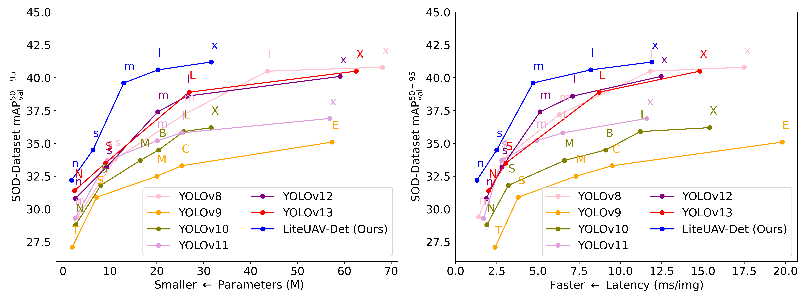
    </td>
  </tr>
</table>
<table border="0">
  <tr>
    <td align="center">
      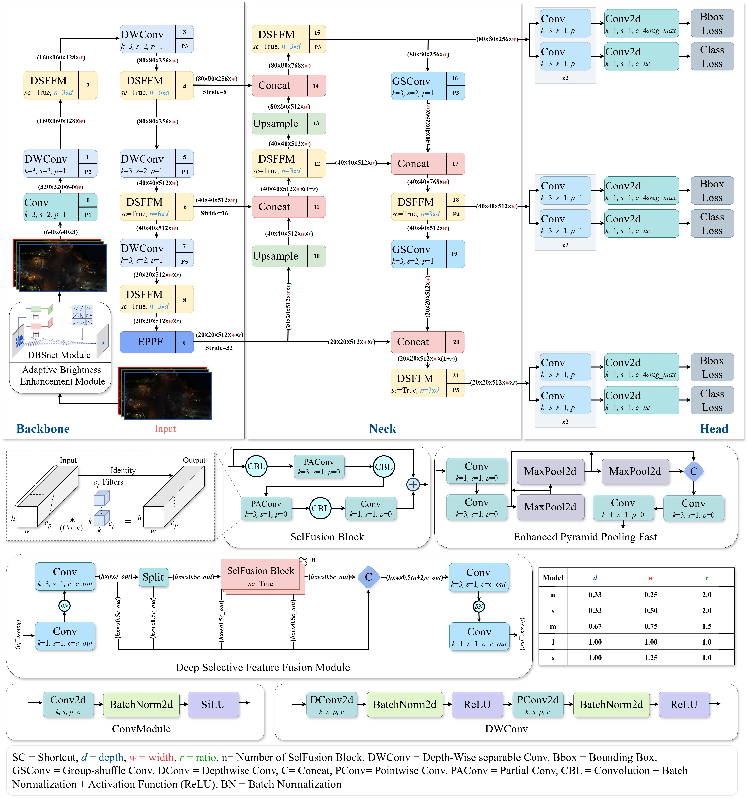
    </td>
  </tr>
</table>
<table border="0">
  <tr>
    <td align="center">
      
    </td>
  </tr>
</table>

---

## Publications (Selected)

### Pepper-4D: spatiotemporal 3D pepper crop dataset for phenotyping

**F. Ahmed†**, D. Li†, B. Zhao, Z. Wang, J. Huang, T. Li, J. Huang, J. Hou, S. Jobaer, and H. Yan*  
<strong>Plants</strong>, 2026. 
† Contributed equally.

**Brief Description:**  
Pepper-4D, a crop-specific spatiotemporal 3D pepper dataset containing 916 reconstructed point clouds from 29 pepper plants, supporting health assessment, semantic segmentation, instance segmentation, organ tracking, new-organ detection, and 3D plant generation.

**Resources**  
- 📄 **Paper:** [https://doi.org/10.3390/plants15040599/  ](https://www.mdpi.com/2223-7747/15/4/599)
- 💻 **Code:** [https://github.com/  ](https://github.com/foysalahmed10/Pepper-4D)

<table border="0">
  <tr>
    <td align="center">
      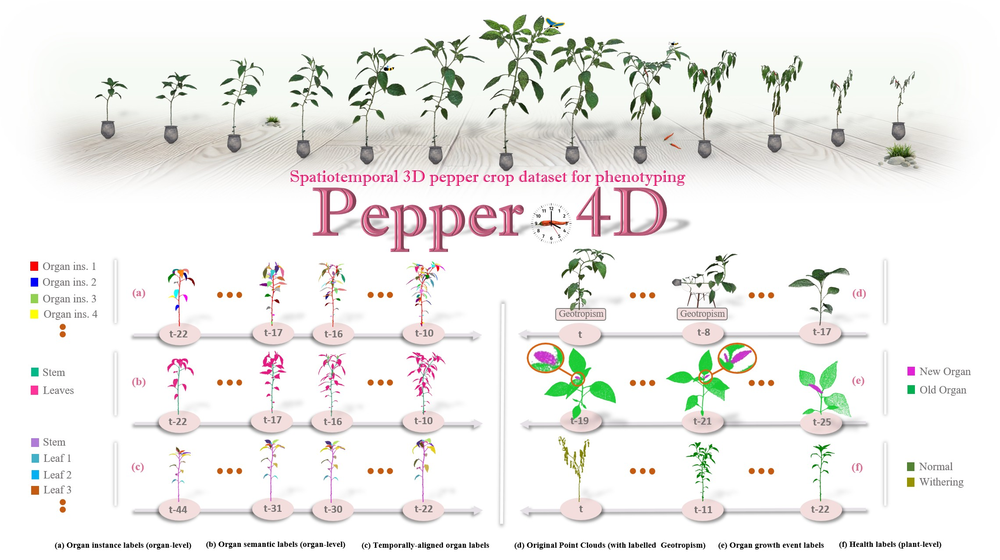
    </td>
  </tr>
</table>
<table border="0">
  <tr>
    <td align="center">
      
    </td>
  </tr>
</table>
<table border="0">
  <tr>
    <td align="center">
      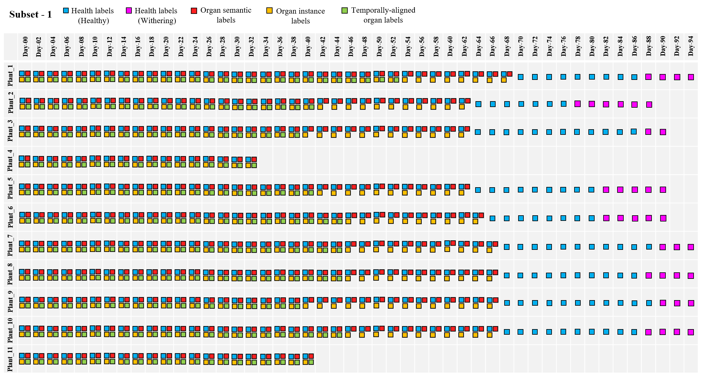
    </td>
  </tr>
</table>

---

### 3D-NOD: 3D New Organ Detection in Plant Growth by a Spatiotemporal Point Cloud Deep Segmentation Framework

Dawei Li†, **Foysal Ahmed**†, Z. Wang†  
<strong>Plant Phenomics</strong>, 2025. 
† Contributed equally.

**Brief Description:**  
This paper presents a spatiotemporal deep learning framework for detecting newly emerged plant organs from 4D point cloud sequences.  
By jointly modeling spatial structure and temporal growth dynamics, the proposed method enables accurate and robust organ-level analysis during plant development.

**Resources**  
- 📄 **Paper:** [https://www.sciencedirect.com](https://doi.org/10.1016/j.plaphe.2025.100002)/  
- 💻 **Code:** [https://github.com/  ](https://github.com/foysalahmed10/3D-New-Organ-Detection-in-Plant-Growth-from-Spatiotemporal-Point-Clouds)

<table border="0">
  <tr>
    <td align="center">
      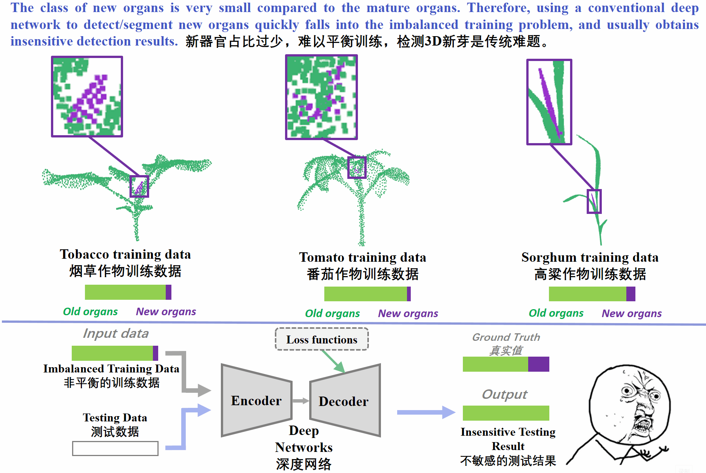
    </td>
  </tr>
</table>
<table border="0">
  <tr>
    <td align="center">
      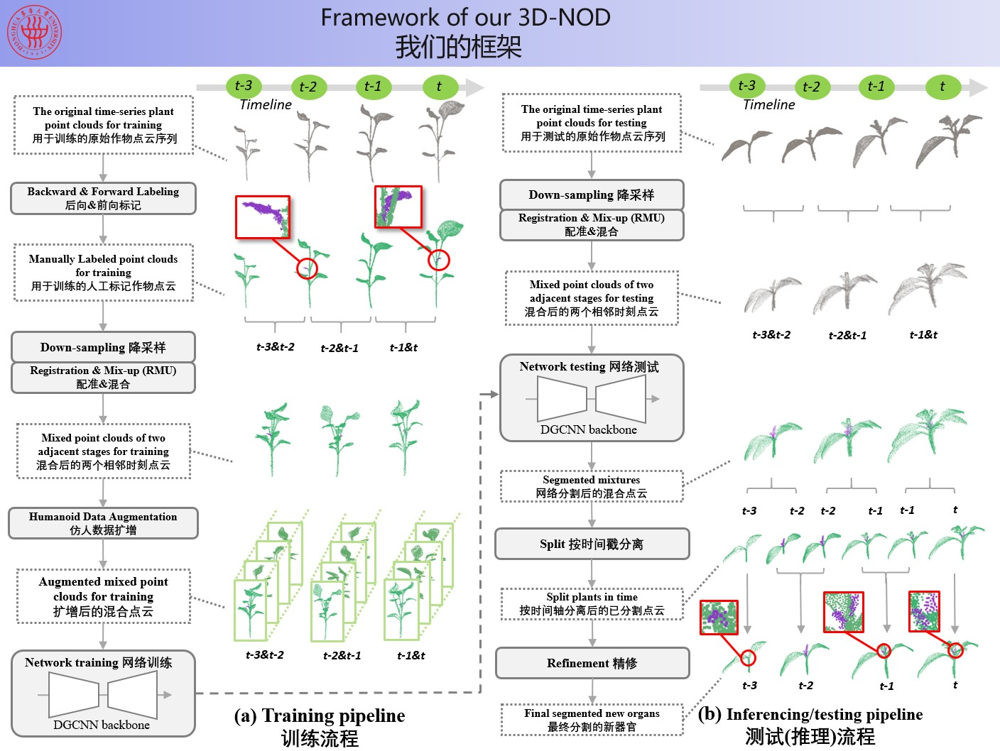
    </td>
  </tr>
</table>
<table border="0">
  <tr>
    <td align="center">
      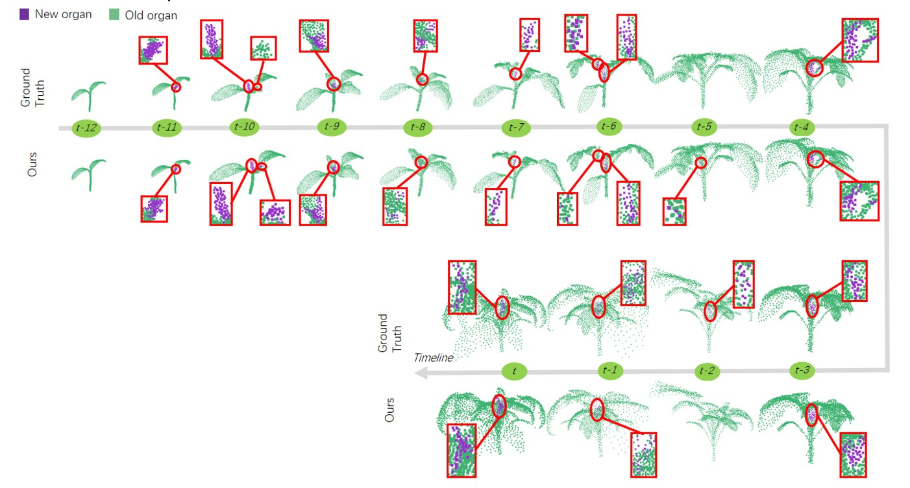
    </td>
  </tr>
</table>

---

### A Novel Knowledge Distillation Framework for Enhancing Small Object Detection in Blurry Environments with UAV-Assisted Images

Sayed Jobaer, Xue-song Tang, Yihong Zhang, Gaojian Li, **Foysal Ahmed**  
<strong>Complex & Intelligent Systems</strong>, 2025.  

**Brief Description:**  
This paper proposes a novel knowledge distillation framework to enhance small object detection performance in blurry UAV-assisted images.  
The method integrates attention-guided feature distillation and a feature-level deblurring subnet within a self-supervised learning paradigm, enabling robust detection without relying on explicit image deblurring. Experimental results on VisDrone and a newly developed UAV small object detection dataset demonstrate consistent performance improvements over state-of-the-art methods.

**Resources**  
- 📄 **Paper:** [https://doi.org/10.1007/s40747-024-01676-w  ](https://link.springer.com/article/10.1007/s40747-024-01676-w)
- 💻 **Code:** *(to be released)*  

<table border="0">
  <tr>
    <td align="center">
      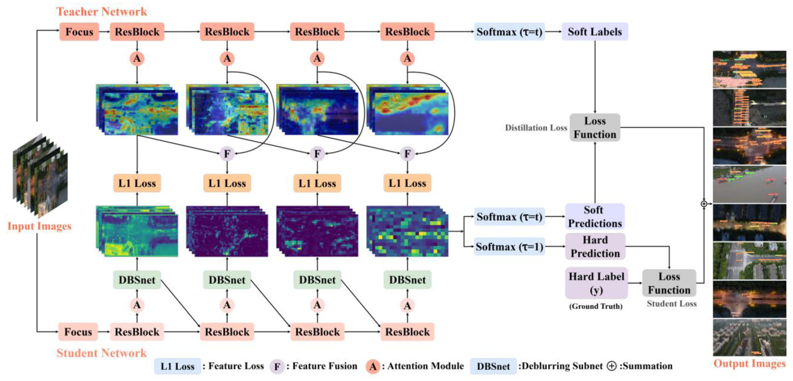
       
      <em>Overview of the proposed knowledge distillation and feature-level deblurring framework.</em>
    </td>
  </tr>
</table>
<table border="0">
  <tr>
    <td align="center">
      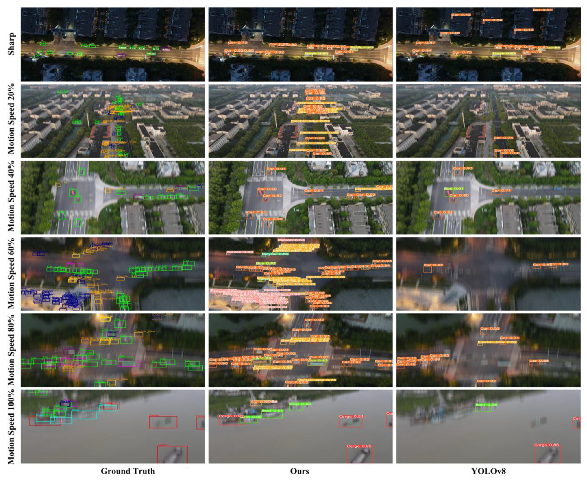
       
      <em>Overview of the proposed knowledge distillation and feature-level deblurring framework.</em>
    </td>
  </tr>
</table>

---

### YOLO-JD: A Deep Learning Network for Jute Diseases and Pests Detection

Dawei Li†, **Foysal Ahmed**†, N. Wu, and A. I. Sethi 
<strong>Plants</strong>, 2022. 
† Contributed equally.

**Brief Description:**  
This work proposes a YOLO-based detection framework for identifying jute diseases and pests from field images, enabling practical and efficient disease monitoring in real agricultural environments.

**Resources**  
- 📄 **Paper:** [https://doi.org/10.3390/plants11070937 ](https://doi.org/10.3390/plants11070937) 
- 💻 **Code:** [https://github.com/foysalahmed10/YOLO-JD  ](https://github.com/foysalahmed10/YOLO-JD)

<table border="0">
  <tr>
    <td align="center">
      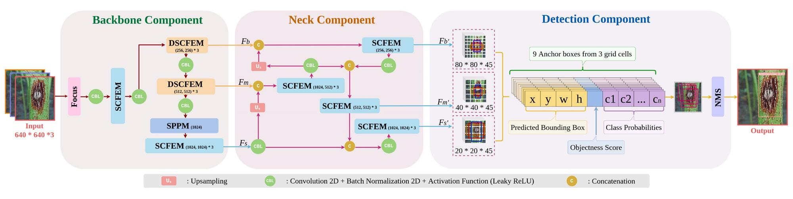
       
      <em>The overall architecture of YOLO-JD.</em>
    </td>
  </tr>
</table>

<table border="0">
  <tr>
    <td align="center">
      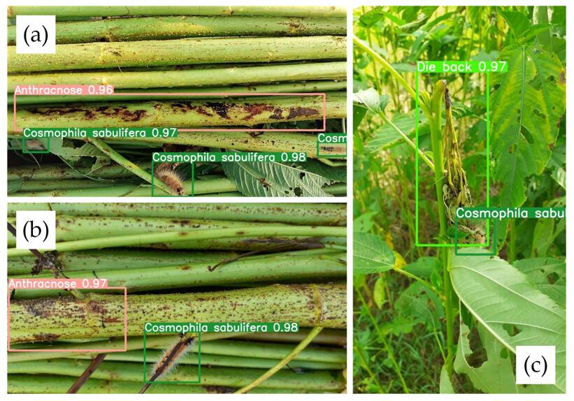
       
      <em>YOLO-JD predictions on complex background images.</em>
    </td>
  </tr>
</table>

---

### UAV-Assisted Hybrid Scheme for Urban Road Safety Based on VANETs

Sayed Jobaer, Yihong Zhang*, Muhammad Ather Iqbal Hussain, **Foysal Ahmed** 
<strong>Electronics</strong>, 2020. 
*Corresponding author.*

**Brief Description:**  
This paper proposes a UAV-assisted hybrid routing framework for urban vehicular ad hoc networks (VANETs) to improve road safety and congestion control. By integrating unmanned aerial vehicles (UAVs) with roadside units and vehicular communication, the proposed scheme enhances packet delivery ratio, reduces end-to-end delay, and improves energy efficiency under realistic urban traffic conditions.

**Resources**  
- 📄 **Paper:** [https://www.mdpi.com/2079-9292/9/9/1499](https://doi.org/10.3390/electronics9091499)
- 💻 **Code:** *(to be released)*  

<table border="0">
  <tr>
    <td align="center">
      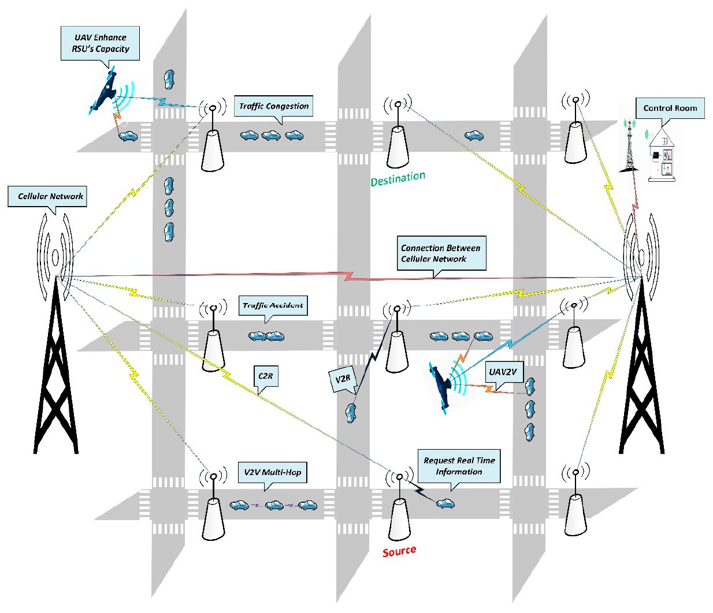
       
      <em>UAV-assisted VANET architecture for urban traffic congestion control.</em>
    </td>
  </tr>
</table>

---

<!-- Visitor Statistics (Footer) -->

  <!-- Page View Counter -->
  

    Page views: —
  

  <!-- Visitor Map -->
  

    
  

<!-- Busuanzi Counter Script -->

